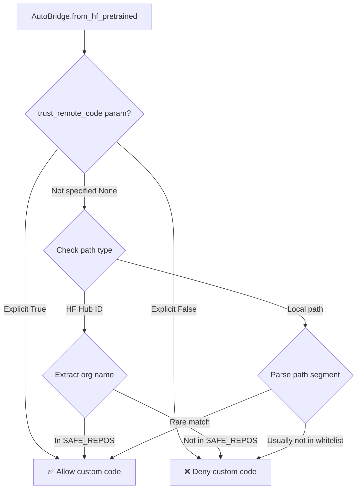

# Extending Megatron Bridge: Advanced Guide

This guide covers two advanced scenarios for extending Megatron Bridge:
1. How to add models that require `trust_remote_code=True`
2. How to integrate new features from Megatron-LM

## Table of Contents
- [Part 1: Supporting trust_remote_code Models](#part-1-supporting-trust_remote_code-models)
  - [Local Checkpoints and Whitelist](#local-checkpoints-and-whitelist)
- [Part 2: Adding Megatron-LM New Features](#part-2-adding-megatron-lm-new-features)
- [Best Practices and Common Pitfalls](#best-practices-and-common-pitfalls)

---

# Part 1: Supporting trust_remote_code Models

## Background

Many models on Hugging Face Hub require `trust_remote_code=True` because they use custom modeling code not included in the standard transformers library. Examples include DeepSeek-V3, some Qwen variants, and community-contributed models.

## Core Mechanism

Megatron Bridge uses **string-based registration + whitelist** to support these models without actually importing their model classes.

### Key Difference

**Standard Transformers models (Type-based registration)**:
```python
from transformers import LlamaForCausalLM  # This imports the model class

@MegatronModelBridge.register_bridge(
    source=LlamaForCausalLM,  # ← Type reference
    target=GPTModel
)
class LlamaBridge(MegatronModelBridge):
    ...
```

**Models requiring trust_remote_code (String-based registration)**:
```python
# No imports needed!

@MegatronModelBridge.register_bridge(
    source="DeepseekV3ForCausalLM",  # ← String reference
    target=GPTModel
)
class DeepSeekV3Bridge(MegatronModelBridge):
    ...
```

## Implementation Steps

### Step 1: Add Organization to Whitelist

Edit `src/megatron/bridge/models/hf_pretrained/utils.py`:

```python
SAFE_REPOS: list[str] = [
    "deepseek-ai",
    "gpt2",
    "google",
    "llava-hf",
    "meta-llama",
    "mistralai",
    "moonshotai",
    "nvidia",
    "openai",
    "Qwen",
    "your-org",  # ← Add your organization here
]
```

**Security Note**: Only add organizations you trust. Adding an organization to this list allows automatic execution of their custom model code.

### Step 2: Create Model Provider

Create `src/megatron/bridge/models/<your_model>/<your_model>_provider.py`:

```python
from megatron.bridge.models.gpt_provider import GPTModelProvider

class YourModelProvider(GPTModelProvider):
    """
    Provider for Your Custom Model architecture.

    Maps HuggingFace config to Megatron-Core TransformerConfig.
    """

    def __init__(
        self,
        num_layers: int,
        hidden_size: int,
        num_attention_heads: int,
        ffn_hidden_size: int,
        num_query_groups: int = None,
        max_position_embeddings: int = 2048,
        rotary_base: float = 10000.0,
        rotary_percent: float = 1.0,
        # Add custom parameters as needed
        **kwargs,
    ):
        super().__init__(
            num_layers=num_layers,
            hidden_size=hidden_size,
            num_attention_heads=num_attention_heads,
            ffn_hidden_size=ffn_hidden_size,
            num_query_groups=num_query_groups,
            max_position_embeddings=max_position_embeddings,
            rotary_base=rotary_base,
            rotary_percent=rotary_percent,
            **kwargs,
        )

        # Configure custom features if needed
        # Example: self.use_custom_attention = True
```

### Step 3: Create Bridge with String Registration

Create `src/megatron/bridge/models/<your_model>/<your_model>_bridge.py`:

```python
import torch
from megatron.core.models.gpt.gpt_model import GPTModel

from megatron.bridge.models.conversion.mapping_registry import MegatronMappingRegistry
from megatron.bridge.models.conversion.model_bridge import MegatronModelBridge
from megatron.bridge.models.conversion.param_mapping import (
    AutoMapping,
    QKVMapping,
    GatedMLPMapping,
)
from megatron.bridge.models.hf_pretrained.causal_lm import PreTrainedCausalLM
from .your_model_provider import YourModelProvider


@MegatronModelBridge.register_bridge(
    source="YourModelForCausalLM",  # ← String! No import of HF class needed
    target=GPTModel
)
class YourModelBridge(MegatronModelBridge):
    """
    Bridge for Your Custom Model.

    This bridge converts between HuggingFace and Megatron formats for
    your custom model architecture.

    Example:
        >>> from megatron.bridge import AutoBridge
        >>> bridge = AutoBridge.from_hf_pretrained(
        ...     "your-org/your-model",
        ...     trust_remote_code=True
        ... )
        >>> provider = bridge.to_megatron_provider()
    """

    def provider_bridge(self, hf_pretrained: PreTrainedCausalLM) -> YourModelProvider:
        """Map HuggingFace config to Megatron provider."""
        cfg = hf_pretrained.config

        return YourModelProvider(
            num_layers=cfg.num_hidden_layers,
            hidden_size=cfg.hidden_size,
            num_attention_heads=cfg.num_attention_heads,
            num_query_groups=getattr(
                cfg, "num_key_value_heads", cfg.num_attention_heads
            ),
            ffn_hidden_size=getattr(
                cfg, "intermediate_size", 4 * cfg.hidden_size
            ),
            max_position_embeddings=getattr(
                cfg, "max_position_embeddings", 2048
            ),
            rotary_base=getattr(cfg, "rope_theta", 10000.0),
            # Map dtype
            fp16=self.dtype_from_hf(cfg) == torch.float16,
            bf16=self.dtype_from_hf(cfg) == torch.bfloat16,
            params_dtype=self.dtype_from_hf(cfg),
            # Add custom config mappings
        )

    def mapping_registry(self) -> MegatronMappingRegistry:
        """Define parameter name mappings between HF and Megatron."""
        return MegatronMappingRegistry(
            # Embeddings
            AutoMapping(
                megatron_param="embedding.word_embeddings.weight",
                hf_param="model.embed_tokens.weight",
            ),
            # Output layer
            AutoMapping(
                megatron_param="output_layer.weight",
                hf_param="lm_head.weight",
            ),
            # Final norm
            AutoMapping(
                megatron_param="decoder.final_layernorm.weight",
                hf_param="model.norm.weight",
            ),
            # Attention QKV (fused in Megatron, separate in HF)
            QKVMapping(
                megatron_param="decoder.layers.*.self_attention.linear_qkv.weight",
                q="model.layers.*.self_attn.q_proj.weight",
                k="model.layers.*.self_attn.k_proj.weight",
                v="model.layers.*.self_attn.v_proj.weight",
            ),
            # Attention output projection
            AutoMapping(
                megatron_param="decoder.layers.*.self_attention.linear_proj.weight",
                hf_param="model.layers.*.self_attn.o_proj.weight",
            ),
            # MLP gated (gate + up fused in Megatron)
            GatedMLPMapping(
                megatron_param="decoder.layers.*.mlp.linear_fc1.weight",
                gate="model.layers.*.mlp.gate_proj.weight",
                up="model.layers.*.mlp.up_proj.weight",
            ),
            # MLP down projection
            AutoMapping(
                megatron_param="decoder.layers.*.mlp.linear_fc2.weight",
                hf_param="model.layers.*.mlp.down_proj.weight",
            ),
            # Layer norms
            AutoMapping(
                megatron_param="decoder.layers.*.self_attention.linear_qkv.layer_norm_weight",
                hf_param="model.layers.*.input_layernorm.weight",
            ),
            AutoMapping(
                megatron_param="decoder.layers.*.mlp.linear_fc1.layer_norm_weight",
                hf_param="model.layers.*.post_attention_layernorm.weight",
            ),
            # Add more mappings as needed for your architecture
        )
```

### Step 4: Register Module

Create `src/megatron/bridge/models/<your_model>/__init__.py`:

```python
from .your_model_bridge import YourModelBridge
from .your_model_provider import YourModelProvider

__all__ = ["YourModelBridge", "YourModelProvider"]
```

Update `src/megatron/bridge/models/__init__.py`:

```python
from . import your_model  # ← Add this import
```

### Step 5: Usage

```python
from megatron.bridge import AutoBridge

# For whitelisted organizations, trust_remote_code is automatic
bridge = AutoBridge.from_hf_pretrained("your-org/your-model")

# For non-whitelisted organizations, explicitly enable
bridge = AutoBridge.from_hf_pretrained(
    "other-org/their-model",
    trust_remote_code=True  # ← Required for non-whitelisted orgs
)

# Convert to Megatron
provider = bridge.to_megatron_provider()
provider.tensor_model_parallel_size = 1
provider.pipeline_model_parallel_size = 1
provider.finalize()
model = provider.provide_distributed_model(wrap_with_ddp=False)

# Export back to HF
bridge.save_hf_pretrained(model, "./exported_model")
```

## Key Concepts Summary

| Aspect | Standard Transformers | trust_remote_code Models |
|--------|----------------------|--------------------------|
| **Registration** | `source=LlamaForCausalLM` (type) | `source="YourModelForCausalLM"` (string) |
| **Whitelist** | Not needed | **Must add to `SAFE_REPOS`** |
| **Import** | Requires `from transformers import ...` | **No HF class import needed** |
| **Detection** | Automatic via type | Via `config.architectures` string matching |

---

## Local Checkpoints and Whitelist

### Question: Do I need to handle whitelist for local checkpoints?

**Short Answer**: **Yes, but differently.** For local paths, you must **explicitly specify** `trust_remote_code=True` because path parsing cannot reliably determine the model's origin.

### How Whitelist Works

The whitelist mechanism in `src/megatron/bridge/models/hf_pretrained/utils.py` follows this logic:

```python
def is_safe_repo(hf_path: str, trust_remote_code: bool | None) -> bool:
    """
    Decide whether remote code execution should be enabled.

    Priority:
    1. If trust_remote_code explicitly provided (True/False), use it
    2. If None, check if repo in SAFE_REPOS whitelist
    3. Otherwise, disable remote code execution
    """
    if trust_remote_code is not None:
        return trust_remote_code  # ← User explicit choice takes precedence

    hf_repo = hf_path.split("/")[0]  # ← Extract organization name
    if hf_repo in SAFE_REPOS:
        return True

    return False
```

### Path Parsing Behavior

```python
# HuggingFace Hub ID (works as expected)
"deepseek-ai/DeepSeek-V3".split("/")[0] = "deepseek-ai"  # ✅ In whitelist

# Local absolute path (doesn't match whitelist)
"/data/models/DeepSeek-V3".split("/")[0] = ""  # ❌ Empty string, not in whitelist

# Windows path (doesn't match whitelist)
"C:\\models\\custom-model".split("/")[0] = "C:\\models\\custom-model"  # ❌ Full path, not in whitelist

# Relative path (unpredictable)
"./my-model".split("/")[0] = "."  # ❌ Not in whitelist
```

### Practical Scenarios

#### Scenario 1: Local Path Without trust_remote_code

```python
# ❌ FAILS! Will throw error
bridge = AutoBridge.from_hf_pretrained("/data/my-custom-model")

# Error message:
# ValueError: trust_remote_code=False. Remote code may not be executed.
```

**Why it fails**:
- Path parsing extracts `""` (empty string) from absolute path
- Empty string is not in `SAFE_REPOS`
- Default `trust_remote_code=False` is used

#### Scenario 2: Local Path With Explicit trust_remote_code

```python
# ✅ SUCCESS!
bridge = AutoBridge.from_hf_pretrained(
    "/data/my-custom-model",
    trust_remote_code=True  # ← Must explicitly specify
)
```

**Why it works**:
- Explicit `trust_remote_code=True` takes precedence over whitelist check
- User explicitly authorizes custom code execution

#### Scenario 3: HuggingFace Hub ID (Whitelisted Organization)

```python
# ✅ SUCCESS! No explicit trust_remote_code needed
bridge = AutoBridge.from_hf_pretrained("deepseek-ai/DeepSeek-V3-Base")

# HuggingFace will:
# 1. Check local cache (~/.cache/huggingface/hub/)
# 2. Use cached version if exists
# 3. Download from Hub if not cached
```

**Why it works**:
- Organization name `deepseek-ai` is in `SAFE_REPOS`
- Automatic caching means second run uses local files
- Whitelist applies to Hub ID, not cache path

#### Scenario 4: HuggingFace Cache Path Directly

```python
# ❌ FAILS! Even though model is from trusted org
bridge = AutoBridge.from_hf_pretrained(
    "/home/user/.cache/huggingface/hub/models--deepseek-ai--DeepSeek-V3-Base/snapshots/abc123"
)

# ✅ CORRECT: Use Hub ID instead
bridge = AutoBridge.from_hf_pretrained(
    "deepseek-ai/DeepSeek-V3-Base"  # HF automatically uses cache
)
```

**Why direct cache path fails**:
- Path parsing cannot extract organization name from cache path structure
- Must use Hub ID for whitelist to work

### Best Practices

#### Practice 1: Always Explicit for Local Paths

```python
# ✅ RECOMMENDED: Always explicit for local paths
bridge = AutoBridge.from_hf_pretrained(
    "/path/to/local/custom-model",
    trust_remote_code=True  # Clear intent
)
```

**Benefits**:
- Code intent is clear
- Avoids path parsing ambiguity
- Works across platforms (Windows/Linux/Mac)

#### Practice 2: Prefer Hub ID Over Direct Paths

```python
# ✅ BEST: Use Hub ID, leverage automatic caching
bridge = AutoBridge.from_hf_pretrained(
    "deepseek-ai/DeepSeek-V3-Base",  # Auto uses ~/.cache/huggingface/
    trust_remote_code=True  # Whitelisted orgs can omit this
)

# HuggingFace transformers automatically:
# 1. Checks local cache first
# 2. Uses cached version if available
# 3. Downloads only if not cached
```

#### Practice 3: Use Absolute Paths

```python
# ❌ BAD: Relative path (depends on cwd)
bridge = AutoBridge.from_hf_pretrained("./my-model", trust_remote_code=True)

# ✅ GOOD: Absolute path
from pathlib import Path
model_path = Path("/absolute/path/to/my-model").resolve()
bridge = AutoBridge.from_hf_pretrained(
    model_path,
    trust_remote_code=True
)
```

#### Practice 4: Handle Symbolic Links

```python
# ✅ RECOMMENDED: Resolve symlinks first
from pathlib import Path

link_path = Path("/link/to/model")
real_path = link_path.resolve()  # Resolves symlinks

bridge = AutoBridge.from_hf_pretrained(
    real_path,
    trust_remote_code=True
)
```

### Common Pitfalls

#### Pitfall 1: Assuming Whitelist Works for Local Paths

```python
# ❌ WRONG: Thinking local path from trusted org is whitelisted
bridge = AutoBridge.from_hf_pretrained(
    "/data/deepseek-ai/DeepSeek-V3"  # Still fails!
)

# ✅ CORRECT: Explicitly trust local paths
bridge = AutoBridge.from_hf_pretrained(
    "/data/deepseek-ai/DeepSeek-V3",
    trust_remote_code=True
)
```

#### Pitfall 2: Windows Path Separators

```python
# ❌ WRONG: Windows backslashes don't split correctly
path = "C:\\models\\custom-model"
path.split("/")  # Returns: ["C:\\models\\custom-model"] (full path)

# ✅ CORRECT: Use pathlib or raw strings
from pathlib import Path
bridge = AutoBridge.from_hf_pretrained(
    Path("C:/models/custom-model"),  # Use forward slashes or pathlib
    trust_remote_code=True
)
```

#### Pitfall 3: Cached Models from Hub

```python
# ❌ WRONG: Trying to load from cache directory directly
cache_path = "~/.cache/huggingface/hub/models--org--model/snapshots/xxx"
bridge = AutoBridge.from_hf_pretrained(cache_path)  # Fails!

# ✅ CORRECT: Use Hub ID, auto-uses cache
bridge = AutoBridge.from_hf_pretrained("org/model")  # Works!
```

### Technical Details: Why This Design?

#### Security Reasoning

```python
# Whitelist design rationale: Automatically trust well-known organizations
SAFE_REPOS = ["deepseek-ai", "Qwen", "meta-llama", ...]

# For HuggingFace Hub IDs
"deepseek-ai/DeepSeek-V3".split("/")[0] = "deepseek-ai"  # ✅ Reliable

# For local paths
"/data/models/DeepSeek-V3".split("/")[0] = ""  # ❌ Unreliable
"C:\\models\\model".split("/")[0] = "C:\\models\\model"  # ❌ Unreliable
"./model".split("/")[0] = "."  # ❌ Unreliable
```

**Why explicit authorization is required for local paths**:
- HuggingFace Hub IDs have fixed format: `org/model`
- Local paths have variable formats: `/data/...`, `C:\...`, `./...`
- Path parsing cannot reliably determine model origin
- **Security principle**: Local paths require explicit user authorization

#### Code Flow Diagram



### Summary Table

| Scenario | Whitelist Required? | Recommended Approach |
|----------|-------------------|---------------------|
| **HF Hub ID (whitelisted org)** | ✅ Auto-applied | `AutoBridge.from_hf_pretrained("deepseek-ai/model")` |
| **HF Hub ID (non-whitelisted)** | ❌ Must explicitly specify | `AutoBridge.from_hf_pretrained("org/model", trust_remote_code=True)` |
| **Local absolute path** | ❌ **Always must specify** | `AutoBridge.from_hf_pretrained("/path", trust_remote_code=True)` |
| **HF cache path** | ❌ **Always must specify** | Use Hub ID instead, auto-uses cache |
| **Relative path** | ❌ **Always must specify** | Convert to absolute first |
| **Windows path** | ❌ **Always must specify** | Use pathlib or forward slashes |

### Key Takeaway

```python
# ✅ BEST PRACTICE: Always explicit for local paths
bridge = AutoBridge.from_hf_pretrained(
    local_model_path,
    trust_remote_code=True,  # Clearly state you trust this local model
)

# ✅ BEST PRACTICE: Use Hub ID for cached models
bridge = AutoBridge.from_hf_pretrained(
    "org/model",  # Transformers auto-uses cache
)
```

**Core Reason**: Local paths cannot reliably determine model origin through string parsing, so explicit user authorization is required for security!

---

# Part 2: Adding Megatron-LM New Features

## Architecture Overview

```
Megatron Bridge (Your Code)
  ↓ depends on
Megatron Core (from 3rdparty/Megatron-LM/)
  ↓ contains
New Features (e.g., new attention, new parallelism strategies)
```

Megatron Bridge acts as a **thin wrapper** that exposes Megatron Core's capabilities through user-friendly APIs.

## Three Integration Scenarios

### Scenario 1: Megatron Core Has Feature, Bridge Doesn't Expose It

**Example**: Megatron Core added `FlashLinearAttention`, but Bridge recipes don't use it yet.

#### Solution Steps

**1. Verify Megatron Core Version**

```bash
cd 3rdparty/Megatron-LM
git log --oneline -5
# Check if submodule contains the feature
```

**2. Update Provider Configuration**

Edit the relevant provider (e.g., `src/megatron/bridge/models/llama/llama_provider.py`):

```python
class LlamaModelProvider(GPTModelProvider):
    def __init__(
        self,
        use_flash_linear_attention: bool = False,  # ← Add parameter
        **kwargs
    ):
        super().__init__(**kwargs)
        self.use_flash_linear_attention = use_flash_linear_attention

    def get_transformer_config(self):
        """Build TransformerConfig with new feature."""
        config = super().get_transformer_config()

        # Pass to Megatron Core
        config.use_flash_linear_attention = self.use_flash_linear_attention

        return config
```

**3. Update ConfigContainer**

Edit `src/megatron/bridge/training/config.py`:

```python
@dataclass
class ModelConfig:
    # ... existing fields ...

    use_flash_linear_attention: bool = False  # ← Expose to users
```

**4. Update Recipe**

Edit recipe files (e.g., `src/megatron/bridge/recipes/llama/llama3.py`):

```python
def llama3_8b_pretrain_config(**kwargs):
    cfg = ConfigContainer(
        model=ModelConfig(
            num_layers=32,
            hidden_size=4096,
            # ... other params ...
            use_flash_linear_attention=True,  # ← Enable new feature
        ),
        # ... rest of config ...
    )
    return cfg
```

**5. Update Documentation**

Add to `docs/megatron-lm-to-megatron-bridge.md`:

```markdown
| megatron-lm arguments | Megatron Bridge config | Description |
| --- | --- | --- |
| `--use-flash-linear-attention` | `model.use_flash_linear_attention` | Enable Flash Linear Attention. |
```

---

### Scenario 2: Megatron Core Added Custom Module (Requires Layer Spec)

**Example**: Megatron Core added `CustomAttentionModule` that you want to use.

#### Solution Steps

**1. Create Custom Layer Spec**

Create `src/megatron/bridge/models/<your_model>/<your_model>_layer_spec.py`:

```python
from megatron.core.transformer.transformer_config import TransformerConfig
from megatron.core.transformer.spec_utils import ModuleSpec
from megatron.core.fusions.fused_layer_norm import FusedLayerNorm

# Import the new module from Megatron Core
from megatron.core.transformer.custom_attention import CustomAttentionModule


def get_custom_layer_spec() -> ModuleSpec:
    """
    Create a layer spec that uses Megatron Core's new CustomAttentionModule.

    Returns:
        ModuleSpec: Specification for building transformer layers with custom attention
    """
    return ModuleSpec(
        module=CustomAttentionModule,
        params={
            "attention_type": "custom",
            "num_attention_heads": None,  # Will be set from TransformerConfig
            # Add other module-specific parameters
        },
        submodules={
            "linear_qkv": ModuleSpec(
                module=torch.nn.Linear,
                params={"bias": False},
            ),
            "core_attention": ModuleSpec(
                module=CustomCoreAttention,  # From Megatron Core
            ),
            "linear_proj": ModuleSpec(
                module=torch.nn.Linear,
                params={"bias": False},
            ),
            "q_layernorm": ModuleSpec(module=FusedLayerNorm),
            "k_layernorm": ModuleSpec(module=FusedLayerNorm),
        },
    )
```

**2. Update Provider to Use Custom Spec**

Edit your model provider:

```python
from .your_model_layer_spec import get_custom_layer_spec

class YourModelProvider(GPTModelProvider):
    def __init__(
        self,
        use_custom_attention: bool = False,
        **kwargs
    ):
        super().__init__(**kwargs)
        self.use_custom_attention = use_custom_attention

    def get_layer_spec(self):
        """Return appropriate layer spec based on configuration."""
        if self.use_custom_attention:
            return get_custom_layer_spec()
        else:
            return super().get_layer_spec()

    def provide_distributed_model(self, **kwargs):
        """Build model with custom layer spec."""
        return super().provide_distributed_model(
            transformer_layer_spec=self.get_layer_spec(),
            **kwargs
        )
```

**3. Update Configuration and Recipe**

Same as Scenario 1: add to `ConfigContainer` and update recipes.

---

### Scenario 3: Megatron Core Version Too Old (Need Submodule Update)

**Example**: You want to use Expert Tensor Parallelism (ETP) added in a newer Megatron Core.

#### Solution Steps

**1. Update Submodule**

```bash
cd /Users/swordfaith/Documents/workspace/Megatron-Bridge

# Navigate to submodule
cd 3rdparty/Megatron-LM

# Check current version
git log --oneline -1

# Fetch latest changes
git fetch origin

# Option A: Update to latest main
git checkout main
git pull origin main

# Option B: Update to specific commit/tag
git checkout <specific-commit-sha>
# or
git checkout release-v0.16.0

# Return to Bridge root
cd ../..

# Stage the submodule update
git add 3rdparty/Megatron-LM

# Commit the update
git commit -m "chore: update Megatron-LM submodule to v0.16.0 for ETP support"
```

**2. Update Dependency Constraints**

Edit `pyproject.toml`:

```toml
dependencies = [
    "megatron-core[dev,mlm]>=0.16.0,<0.18.0",  # ← Update version range
    # ... other dependencies ...
]
```

**3. Test Compatibility**

```bash
# Run unit tests
uv run pytest tests/unit_tests/ -v

# Run functional tests
uv run pytest tests/functional_tests/ -m unit -v

# Check for breaking changes
uv run pytest tests/ --tb=short
```

**4. Use New Feature in Bridge**

After confirming compatibility, use the new feature:

```python
# src/megatron/bridge/recipes/qwen/qwen3_moe.py
def qwen3_moe_pretrain_config(**kwargs):
    cfg = ConfigContainer(
        model=ModelConfig(
            # Use new ETP feature from updated Megatron Core
            expert_tensor_parallel_size=4,
            moe_expert_capacity_factor=1.25,
            # ... other params ...
        ),
        # ... rest of config ...
    )
    return cfg
```

**5. Update CI Configuration (Optional)**

If the update might affect CI, check `.github/workflows/cicd-main.yml`:

```yaml
# CI automatically tests MCore compatibility
- name: Update MCore submodule (if triggered from MCore)
  if: ${{ github.event.inputs.mcore_commit != '' }}
  run: |
    cd 3rdparty/Megatron-LM
    git fetch ${{ github.event.inputs.mcore_repo }}
    git checkout ${{ github.event.inputs.mcore_commit }}
```

---

## Complete Example: Adding a New Feature End-to-End

Let's walk through adding support for a hypothetical `fused_qkv_gemm` feature from Megatron Core.

### Step 1: Verify MCore Support

```bash
cd 3rdparty/Megatron-LM
git log --grep="fused_qkv_gemm" --oneline
# Output: abc1234 Add fused QKV GEMM kernel support
```

### Step 2: Update Base Provider

Edit `src/megatron/bridge/models/gpt_provider.py`:

```python
class GPTModelProvider(ModelProviderMixin):
    def __init__(
        self,
        num_layers: int,
        hidden_size: int,
        num_attention_heads: int,
        fused_qkv_gemm: bool = False,  # ← Add parameter
        **kwargs,
    ):
        super().__init__(**kwargs)
        self.num_layers = num_layers
        self.hidden_size = hidden_size
        self.num_attention_heads = num_attention_heads
        self.fused_qkv_gemm = fused_qkv_gemm  # ← Store parameter

    def get_transformer_config(self):
        """Build TransformerConfig for Megatron Core."""
        config = TransformerConfig(
            num_layers=self.num_layers,
            hidden_size=self.hidden_size,
            num_attention_heads=self.num_attention_heads,
            fused_qkv_gemm=self.fused_qkv_gemm,  # ← Pass to MCore
            # ... other params ...
        )
        return config
```

### Step 3: Update ConfigContainer

Edit `src/megatron/bridge/training/config.py`:

```python
@dataclass
class ModelConfig:
    """Model architecture configuration."""

    # ... existing fields ...

    fused_qkv_gemm: bool = False  # ← Add configuration option
    """Enable fused QKV GEMM kernel for improved attention performance."""
```

### Step 4: Update Recipes

Edit `src/megatron/bridge/recipes/llama/llama3.py`:

```python
def llama3_8b_pretrain_config(
    seq_length: int = 8192,
    enable_fused_qkv: bool = True,  # ← Add parameter
    **overrides
) -> ConfigContainer:
    """
    Llama 3 8B pretraining configuration.

    Args:
        seq_length: Maximum sequence length
        enable_fused_qkv: Enable fused QKV GEMM optimization
        overrides: Additional config overrides
    """
    cfg = ConfigContainer(
        model=ModelConfig(
            num_layers=32,
            hidden_size=4096,
            num_attention_heads=32,
            num_query_groups=8,
            ffn_hidden_size=14336,
            max_position_embeddings=seq_length,
            fused_qkv_gemm=enable_fused_qkv,  # ← Enable feature
            # ... other params ...
        ),
        # ... rest of config ...
    )

    return cfg
```

### Step 5: Add Tests

Create `tests/unit_tests/models/test_fused_qkv_feature.py`:

```python
import pytest
from megatron.bridge.models.gpt_provider import GPTModelProvider


def test_fused_qkv_gemm_config():
    """Test that fused_qkv_gemm config is properly passed to TransformerConfig."""
    provider = GPTModelProvider(
        num_layers=12,
        hidden_size=768,
        num_attention_heads=12,
        fused_qkv_gemm=True,  # ← Enable feature
    )
    provider.finalize()

    config = provider.get_transformer_config()
    assert config.fused_qkv_gemm is True, "fused_qkv_gemm should be enabled"


def test_fused_qkv_gemm_default_disabled():
    """Test that fused_qkv_gemm is disabled by default."""
    provider = GPTModelProvider(
        num_layers=12,
        hidden_size=768,
        num_attention_heads=12,
    )
    provider.finalize()

    config = provider.get_transformer_config()
    assert config.fused_qkv_gemm is False, "fused_qkv_gemm should be disabled by default"
```

Run tests:

```bash
uv run pytest tests/unit_tests/models/test_fused_qkv_feature.py -v
```

### Step 6: Update Documentation

Add to `docs/megatron-lm-to-megatron-bridge.md`:

```markdown
### Model architecture knobs

| megatron-lm arguments | Megatron Bridge config | Description |
| --- | --- | --- |
| `--fused-qkv-gemm` | `model.fused_qkv_gemm` | Enable fused QKV GEMM kernels for improved attention performance. |
```

Add to `CLAUDE.md`:

```markdown
### Performance Features
- **Fused QKV GEMM**: Enable with `cfg.model.fused_qkv_gemm = True` for improved attention performance
```

### Step 7: Create PR

```bash
git add src/megatron/bridge/models/gpt_provider.py
git add src/megatron/bridge/training/config.py
git add src/megatron/bridge/recipes/llama/llama3.py
git add tests/unit_tests/models/test_fused_qkv_feature.py
git add docs/megatron-lm-to-megatron-bridge.md
git add CLAUDE.md

git commit -s -m "feat: add support for fused QKV GEMM from Megatron Core

- Add fused_qkv_gemm parameter to GPTModelProvider
- Expose configuration in ConfigContainer.ModelConfig
- Enable by default in Llama 3 recipes
- Add unit tests for feature toggle
- Update documentation

Resolves #XXX"

git push origin feature/fused-qkv-gemm
```

---

# Best Practices and Common Pitfalls

## Best Practices

### 1. Bridge is a Thin Wrapper
- ✅ **DO**: Expose Megatron Core features through configuration
- ❌ **DON'T**: Re-implement Megatron Core functionality in Bridge

### 2. Contribute Upstream First
- ✅ **DO**: Submit new features to Megatron-LM first, then integrate to Bridge
- ❌ **DON'T**: Fork and modify Megatron-LM submodule directly

```bash
# ❌ Wrong: Modify submodule directly
cd 3rdparty/Megatron-LM
vim megatron/core/transformer/attention.py  # Direct modification

# ✅ Correct: Fork, PR to upstream, then reference
# 1. Fork NVIDIA/Megatron-LM on GitHub
# 2. Make changes in your fork
# 3. Submit PR to upstream
# 4. Temporarily point to your fork in pyproject.toml
[tool.uv.sources]
megatron-core = { git = "https://github.com/YOUR_USERNAME/Megatron-LM.git", rev = "feature-branch" }
```

### 3. TransformerConfig is the Interface
All Megatron Core configuration flows through `TransformerConfig`:

```python
# Bridge Config → Provider → TransformerConfig → Megatron Core
cfg.model.num_layers → provider.num_layers → TransformerConfig.num_layers → GPTModel
```

### 4. Test Compatibility Thoroughly

```bash
# Test suite for new features
uv run pytest tests/unit_tests/ -v           # Fast unit tests
uv run pytest tests/functional_tests/ -v     # Integration tests
uv run pytest tests/ --tb=short              # Full suite with short traceback
```

### 5. Version Constraints Matter

```toml
# Be specific about version ranges
dependencies = [
    "megatron-core[dev,mlm]>=0.16.0,<0.18.0",  # ✅ Good: Specific range
    # "megatron-core",  # ❌ Bad: No version constraint
]
```

## Common Pitfalls

### 1. Forgetting to Update Submodule

```bash
# Symptom: Feature exists in MCore but Bridge can't access it
# Fix:
git submodule update --init --recursive
cd 3rdparty/Megatron-LM
git checkout main
git pull origin main
```

### 2. String Registration Typo

```python
# ❌ Wrong: Typo in architecture name
@MegatronModelBridge.register_bridge(
    source="DeepseekV3ForCasualLM",  # ← Typo: "Casual" not "Causal"
    target=GPTModel
)

# ✅ Correct: Match exact architecture string from config.json
@MegatronModelBridge.register_bridge(
    source="DeepseekV3ForCausalLM",  # ← Matches config.architectures
    target=GPTModel
)
```

To find the correct string:
```bash
# Check config.json in HF model
curl https://huggingface.co/deepseek-ai/DeepSeek-V3-Base/raw/main/config.json | jq .architectures
# Output: ["DeepseekV3ForCausalLM"]
```

### 3. Not Finalizing Provider

```python
# ❌ Wrong: Forget to call finalize()
provider = bridge.to_megatron_provider()
provider.tensor_model_parallel_size = 4
model = provider.provide_distributed_model()  # May use wrong config!

# ✅ Correct: Always call finalize() before instantiation
provider = bridge.to_megatron_provider()
provider.tensor_model_parallel_size = 4
provider.finalize()  # ← Validates and locks configuration
model = provider.provide_distributed_model()
```

### 4. Incompatible MCore Version

```bash
# Symptom: AttributeError: 'TransformerConfig' has no attribute 'new_feature'
# Cause: Submodule too old

# Fix:
cd 3rdparty/Megatron-LM
git log --all --grep="new_feature"  # Find when feature was added
git checkout <commit-with-feature>

# Update dependency constraint
# Edit pyproject.toml:
dependencies = ["megatron-core>=0.XX.0,<0.YY.0"]
```

### 5. Parameter Mapping Mismatch

```python
# ❌ Wrong: Wildcard count mismatch
QKVMapping(
    megatron_param="decoder.layers.*.self_attention.linear_qkv.weight",  # 1 wildcard
    q="model.layers.*.*.self_attn.q_proj.weight",  # 2 wildcards - MISMATCH!
    k="model.layers.*.*.self_attn.k_proj.weight",
    v="model.layers.*.*.self_attn.v_proj.weight",
)

# ✅ Correct: Same wildcard count
QKVMapping(
    megatron_param="decoder.layers.*.self_attention.linear_qkv.weight",  # 1 wildcard
    q="model.layers.*.self_attn.q_proj.weight",  # 1 wildcard - MATCH!
    k="model.layers.*.self_attn.k_proj.weight",
    v="model.layers.*.self_attn.v_proj.weight",
)
```

### 6. Not Adding to Whitelist

```python
# Symptom: trust_remote_code=False warning
# Cause: Organization not in SAFE_REPOS

# Fix: Add to src/megatron/bridge/models/hf_pretrained/utils.py
SAFE_REPOS: list[str] = [
    # ... existing repos ...
    "your-org",  # ← Add this
]
```

## Debugging Tips

### Enable Verbose Logging

```python
import logging
logging.getLogger("megatron.bridge").setLevel(logging.DEBUG)

# Now you'll see detailed conversion logs
bridge = AutoBridge.from_hf_pretrained("model-id")
```

### Check Bridge Registration

```python
from megatron.bridge import AutoBridge

# List all supported models
supported = AutoBridge.list_supported_models()
print(f"Supported architectures: {supported}")

# Check if specific model is supported
if AutoBridge.can_handle("your-org/your-model"):
    print("✅ Model is supported")
else:
    print("❌ Model requires custom bridge")
```

### Inspect Parameter Mappings

```python
bridge = AutoBridge.from_hf_pretrained("model-id")
provider = bridge.to_megatron_provider()
provider.finalize()
model = provider.provide_distributed_model(wrap_with_ddp=False)

# Get all conversion tasks
tasks = bridge.get_conversion_tasks(model)

# Print mappings
for task in tasks[:10]:  # First 10 tasks
    print(f"Megatron: {task.param_name}")
    print(f"Mapping: {task.mapping.__class__.__name__}")
    print("---")
```

### Test Conversion Without Full Model

```python
from transformers import AutoConfig
from megatron.bridge import AutoBridge

# Load only config (no weights)
config = AutoConfig.from_pretrained("model-id")
bridge = AutoBridge.from_hf_config(config)

# Check TransformerConfig
transformer_config = bridge.transformer_config
print(f"Layers: {transformer_config.num_layers}")
print(f"Hidden: {transformer_config.hidden_size}")
print(f"Heads: {transformer_config.num_attention_heads}")
```

## Summary

| Task | Key Steps | Main Pitfalls |
|------|-----------|---------------|
| **Add trust_remote_code model** | 1. String registration<br>2. Add to SAFE_REPOS<br>3. Create Provider + Bridge | • Typo in architecture name<br>• Forgetting whitelist |
| **Expose MCore feature** | 1. Add to Provider<br>2. Update ConfigContainer<br>3. Update recipes | • Forgetting finalize()<br>• Not updating docs |
| **Update MCore version** | 1. Update submodule<br>2. Update pyproject.toml<br>3. Test compatibility | • Breaking changes<br>• Version constraint mismatch |

## Additional Resources

- [Model Bridges Overview](../src/megatron/bridge/models/README.md)
- [Adding New Models Guide](./adding-new-models.md)
- [Bridge Technical Details](./bridge-tech-details.md)
- [Megatron-LM to Bridge Config Mapping](./megatron-lm-to-megatron-bridge.md)
- [Megatron-LM Repository](https://github.com/NVIDIA/Megatron-LM)
